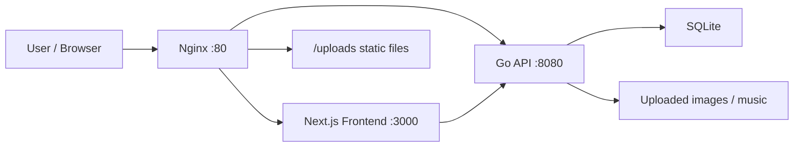

# Piexls Blog

> A pixel-flavored personal blog system built for writing, publishing, and archiving markdown notes with music, media uploads, and a lightweight admin panel.

## Intro

`Piexls Blog` 是一个偏像素风、偏个人表达的博客项目。它把内容创作、Markdown 发布、音乐播放器、媒体上传和低成本部署揉在了一起，目标不是做一个通用 CMS，而是做一个在小内存云服务器上也能稳定运行、风格足够鲜明的个人博客。

项目参考了 [pixel-blog.com](https://pixel-blog.com/) 的整体视觉方向，并结合当前仓库实现了完整的前后端分离结构：

- 前端：Next.js 14 + React 18 + TypeScript + Tailwind CSS
- 后端：Go + Gin + GORM + SQLite
- 部署：Docker Compose + Nginx
- 数据持久化：`./data/blog.db` 与 `./backend/uploads`

## Highlights

- 像素风 UI 组件体系，适合个人博客、开发笔记和作品展示
- 支持分类、标签、文章发布与草稿管理
- 支持 Markdown 编辑与直接导入 `.md` 文件
- 导入 Markdown 时可同步处理本地图片，避免图片链接丢失
- 支持图片上传、文章封面上传、音乐上传与排序
- 内置侧边栏音乐播放器
- 使用 SQLite，部署轻量，适合低配置云服务器
- 提供低内存友好的 `deploy.sh` 发布脚本

## Preview Architecture



## Tech Stack

| Layer | Stack |
| --- | --- |
| Frontend | Next.js 14, React 18, TypeScript, Tailwind CSS |
| Rendering | App Router, SSR, SSG, ISR, Client Components |
| Markdown | react-markdown, remark-gfm, rehype-highlight, rehype-slug |
| State | Zustand, React Query |
| Backend | Go, Gin, GORM |
| Database | SQLite with pure-Go driver `modernc.org/sqlite` |
| Auth | JWT |
| Reverse Proxy | Nginx |
| Deployment | Docker Compose |

## Main Features

### Public Blog

- 首页文章列表
- 分类页与标签页
- 文章详情页
- 文章封面展示
- Markdown 渲染与代码高亮
- 侧边栏音乐播放器
- 移动端导航适配

### Admin Panel

- 管理员登录
- 新建、编辑、删除文章
- 草稿与发布状态切换
- 分类与标签管理
- 图片上传
- 音乐上传、删除、排序
- 直接导入 Markdown 文件
- 导入时自动匹配并上传本地图片资源

## Project Structure

```text
Piexls_Blog/
├── README.md
├── docker-compose.yml
├── deploy.sh
├── .env.example
├── nginx/
│   └── nginx.conf
├── backend/
│   ├── main.go
│   ├── config/
│   ├── database/
│   ├── handlers/
│   ├── middleware/
│   ├── models/
│   ├── services/
│   ├── tests/
│   └── uploads/
├── frontend/
│   ├── Dockerfile
│   ├── package.json
│   └── src/
│       ├── app/
│       ├── components/
│       ├── lib/
│       ├── stores/
│       └── types/
└── data/
```

## Quick Start

### 1. Prepare env

复制环境变量模板：

```bash
cp .env.example .env
```

然后至少配置：

```env
JWT_SECRET=replace-with-a-strong-secret
ADMIN_USER=admin
ADMIN_PASS=replace-with-a-strong-password
```

注意：

- `ADMIN_PASS` 必须存在，否则后端首次启动会直接退出
- 管理员账号只会在数据库没有用户时初始化一次

### 2. Local development

#### Frontend

```bash
cd frontend
npm install
npm run dev
```

#### Backend

```bash
cd backend
go mod download
go run main.go
```

默认端口：

- Frontend: `3000`
- Backend: `8080`

## Docker Deployment

### Standard deployment

```bash
docker compose build
docker compose up -d
```

### Low-memory server deployment

如果你的云服务器内存比较紧张，推荐直接使用仓库自带脚本：

```bash
chmod +x deploy.sh
./deploy.sh
```

当前脚本会：

- 输出当前部署 commit
- 停掉旧容器并清理孤儿容器
- 分步构建 `backend` 和 `frontend`
- 先启动后端，再启动前端
- 强制重建 `nginx`，确保网关配置与静态资源路由生效
- 最后输出容器状态

## Persistent Data

容器销毁后仍会保留的数据：

- 数据库：`./data/blog.db`
- 图片与音乐文件：`./backend/uploads`

对应的 Docker 卷挂载已经在 `docker-compose.yml` 中配置好。

## Core Routes

### Public

- `/`
- `/posts/[slug]`
- `/category/[slug]`
- `/tag/[slug]`

### Admin

- `/admin/login`
- `/admin/posts`
- `/admin/posts/new`
- `/admin/posts/[id]/edit`
- `/admin/categories`
- `/admin/tags`
- `/admin/music`

## API Overview

### Public API

- `GET /api/posts`
- `GET /api/posts/:slug`
- `GET /api/categories`
- `GET /api/tags`
- `GET /api/music`

### Auth

- `POST /api/auth/login`
- `POST /api/auth/refresh`

### Admin API

- `GET /api/admin/posts`
- `POST /api/admin/posts`
- `PUT /api/admin/posts/:id`
- `DELETE /api/admin/posts/:id`
- `POST /api/admin/categories`
- `PUT /api/admin/categories/:id`
- `DELETE /api/admin/categories/:id`
- `POST /api/admin/tags`
- `PUT /api/admin/tags/:id`
- `DELETE /api/admin/tags/:id`
- `POST /api/admin/upload/image`
- `POST /api/admin/music`
- `PUT /api/admin/music/reorder`
- `DELETE /api/admin/music/:id`

统一返回格式：

```json
{
  "code": 200,
  "data": {},
  "message": "ok"
}
```

## Media & Markdown Notes

- 图片上传接口会返回可直接使用的 URL
- 音乐文件存放在 `uploads/music/`
- 图片文件存放在 `uploads/images/`
- 文章封面、正文图片和音乐封面已经统一做了媒体 URL 处理
- Markdown 导入器支持处理本地图片路径，并优先按相对路径匹配文件

这意味着你可以直接把本地 `.md` 笔记导入后台，再补传对应图片，不需要手动逐条替换路径。

## Testing

后端已经包含基础接口测试，可以运行：

```bash
cd backend
go test ./...
```

前端当前以构建校验和手工联调为主：

```bash
cd frontend
npm run build
```

## Troubleshooting

### 1. Docker 部署后页面没变化

优先确认：

```bash
git pull origin master
./deploy.sh
docker compose ps
```

如果依然是旧页面，通常需要检查：

- 是否真的拉到了最新 commit
- `frontend` 是否重新构建成功
- `nginx` 是否被强制重建
- 浏览器是否命中了缓存

### 2. 出现 502

先看容器日志：

```bash
docker compose logs --tail=200 nginx
docker compose logs --tail=200 frontend
docker compose logs --tail=200 backend
```

重点关注：

- `frontend` 是否健康
- `backend` 是否健康
- `nginx` 是否连不上 `frontend:3000` 或 `backend:8080`
- `.env` 是否缺少 `ADMIN_PASS` 或 `JWT_SECRET`

### 3. 图片或音乐不显示

确认：

- 上传文件是否存在于 `backend/uploads`
- `/uploads/` 路由是否被 Nginx 正常代理或直出
- 是否使用了旧版本镜像或旧容器

## Design Notes

这个项目的重点不是“后台功能堆满”，而是让博客本身有一点游戏机 UI 的手感：

- 边框硬朗
- 阴影偏像素块
- 卡片和按钮有按压感
- 排版不是传统技术博客模板那种冷淡风
- 音乐播放器作为情绪组件一直存在

它更像一台可以写博客的像素掌机，而不是标准化内容管理后台。

## License

当前仓库未单独声明 License。如需开源分发，建议补充 `LICENSE` 文件后再公开发布。
