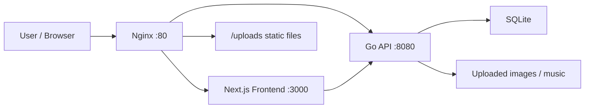

# Piexls Blog

> A pixel-inspired personal blog platform for publishing markdown notes, managing media, and deploying on lightweight cloud servers.

## Overview

Piexls Blog is a stylized personal blogging system designed for developers, indie makers, and anyone who wants a blog with more personality than a generic CMS. It combines a pixel-art visual language with a practical publishing workflow: markdown writing, cover uploads, music playback, admin management, and lightweight deployment.

The project takes visual inspiration from [pixel-blog.com](https://pixel-blog.com/) while using a frontend-backend split that is easy to maintain and affordable to run on small VPS machines.

- Frontend: Next.js 14 + React 18 + TypeScript + Tailwind CSS
- Backend: Go + Gin + GORM + SQLite
- Deployment: Docker Compose + Nginx
- Persistent data: `./data/blog.db` and `./backend/uploads`

## Highlights

- Distinctive pixel-style UI system for a more memorable blog experience
- Post publishing workflow with draft and published states
- Category and tag management
- Markdown editing and direct `.md` import
- Local image handling during markdown import so image references are not lost
- Image upload for covers and inline content
- Music upload, playlist management, and sidebar player
- SQLite-based storage with low operational cost
- Low-memory deployment flow via `deploy.sh`

## Architecture



## Tech Stack

| Layer | Stack |
| --- | --- |
| Frontend | Next.js 14, React 18, TypeScript, Tailwind CSS |
| Rendering | App Router, SSR, SSG, ISR, Client Components |
| Markdown | react-markdown, remark-gfm, rehype-highlight, rehype-slug |
| State | Zustand, React Query |
| Backend | Go, Gin, GORM |
| Database | SQLite with the pure-Go `modernc.org/sqlite` driver |
| Auth | JWT |
| Reverse Proxy | Nginx |
| Deployment | Docker Compose |

## Core Features

### Public Blog

- Homepage post listing
- Category pages and tag pages
- Post detail pages
- Cover image display
- Markdown rendering with syntax highlighting
- Sidebar music player
- Mobile-friendly navigation

### Admin Panel

- Admin login
- Create, edit, and delete posts
- Draft and publish controls
- Category and tag management
- Image upload
- Music upload, deletion, and reordering
- Direct markdown file import
- Local image matching and upload during markdown import

## Project Structure

```text
Piexls_Blog/
├── README.md
├── docker-compose.yml
├── deploy.sh
├── .env.example
├── nginx/
│   └── nginx.conf
├── backend/
│   ├── main.go
│   ├── config/
│   ├── database/
│   ├── handlers/
│   ├── middleware/
│   ├── models/
│   ├── services/
│   ├── tests/
│   └── uploads/
├── frontend/
│   ├── Dockerfile
│   ├── package.json
│   └── src/
│       ├── app/
│       ├── components/
│       ├── lib/
│       ├── stores/
│       └── types/
└── data/
```

## Getting Started

### 1. Prepare environment variables

Copy the template:

```bash
cp .env.example .env
```

At minimum, configure:

```env
JWT_SECRET=replace-with-a-strong-secret
ADMIN_USER=admin
ADMIN_PASS=replace-with-a-strong-password
```

Important notes:

- `ADMIN_PASS` must be set or the backend will stop on first startup
- The admin account is only seeded when the database has no users yet

### 2. Local development

#### Frontend

```bash
cd frontend
npm install
npm run dev
```

#### Backend

```bash
cd backend
go mod download
go run main.go
```

Default ports:

- Frontend: `3000`
- Backend: `8080`

## Docker Deployment

### Standard deployment

```bash
docker compose build
docker compose up -d
```

### Low-memory server deployment

If your cloud server has limited memory, use the included deployment script:

```bash
chmod +x deploy.sh
./deploy.sh
```

The script currently:

- prints the current commit
- stops old containers and removes orphans
- builds `backend` and `frontend` one at a time
- starts the backend first, then the frontend
- force-recreates `nginx` so gateway and static routing changes take effect
- prints the final container status

## Persistent Data

The following data survives container recreation:

- Database: `./data/blog.db`
- Uploaded images and music: `./backend/uploads`

The required volume mounts are already configured in `docker-compose.yml`.

## Main Routes

### Public

- `/`
- `/posts/[slug]`
- `/category/[slug]`
- `/tag/[slug]`

### Admin

- `/admin/login`
- `/admin/posts`
- `/admin/posts/new`
- `/admin/posts/[id]/edit`
- `/admin/categories`
- `/admin/tags`
- `/admin/music`

## API Overview

### Public API

- `GET /api/posts`
- `GET /api/posts/:slug`
- `GET /api/categories`
- `GET /api/tags`
- `GET /api/music`

### Auth

- `POST /api/auth/login`
- `POST /api/auth/refresh`

### Admin API

- `GET /api/admin/posts`
- `POST /api/admin/posts`
- `PUT /api/admin/posts/:id`
- `DELETE /api/admin/posts/:id`
- `POST /api/admin/categories`
- `PUT /api/admin/categories/:id`
- `DELETE /api/admin/categories/:id`
- `POST /api/admin/tags`
- `PUT /api/admin/tags/:id`
- `DELETE /api/admin/tags/:id`
- `POST /api/admin/upload/image`
- `POST /api/admin/music`
- `PUT /api/admin/music/reorder`
- `DELETE /api/admin/music/:id`

Common response shape:

```json
{
  "code": 200,
  "data": {},
  "message": "ok"
}
```

## Media and Markdown Notes

- The image upload endpoint returns a directly usable URL
- Music files are stored under `uploads/music/`
- Image files are stored under `uploads/images/`
- Cover images, inline post images, and music covers share unified media URL handling
- The markdown importer supports local image paths and prefers relative-path matching

That means you can import a local markdown article, upload the related images, and keep the content structure intact without manually rewriting every image reference.

## Testing

The backend includes baseline API tests:

```bash
cd backend
go test ./...
```

The frontend currently relies mainly on build verification and manual integration testing:

```bash
cd frontend
npm run build
```

## Troubleshooting

### The deployed UI did not change

Start with:

```bash
git pull origin master
./deploy.sh
docker compose ps
```

If the old UI still appears, check:

- whether the latest commit was actually pulled
- whether the frontend image was rebuilt successfully
- whether `nginx` was force-recreated
- whether the browser is serving cached assets

### 502 Bad Gateway

Inspect the container logs:

```bash
docker compose logs --tail=200 nginx
docker compose logs --tail=200 frontend
docker compose logs --tail=200 backend
```

Focus on:

- whether `frontend` is healthy
- whether `backend` is healthy
- whether `nginx` cannot reach `frontend:3000` or `backend:8080`
- whether `.env` is missing `ADMIN_PASS` or `JWT_SECRET`

### Images or music are not showing

Verify:

- the files exist under `backend/uploads`
- `/uploads/` is served correctly by Nginx
- the deployment is not still using older containers or images

## Design Direction

This project is intentionally not aiming to be a feature-heavy enterprise CMS. Its personality is part of the product:

- hard-edged borders
- blocky shadows
- card and button press feedback
- more expressive visual rhythm than a standard tech blog template
- a persistent music player as part of the blog’s mood

It is meant to feel more like a handheld pixel device for publishing thoughts than a generic content dashboard.

## License

No explicit license is included in the repository yet. If you plan to publish or distribute it openly, adding a `LICENSE` file is recommended.
